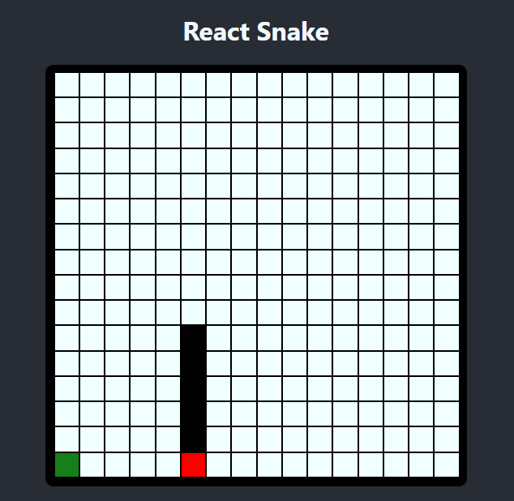
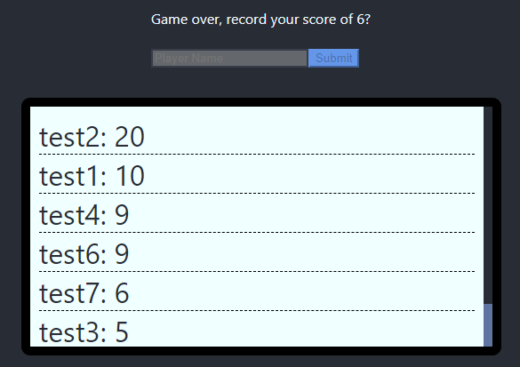

#react-snake
 
 
Simple snake game using json-server to implement a simple scoreboard system.

## How to Run?
To run snake:
`npm start`  
To boot up the scoreboard server:
`json-server --watch db.json --port 3001`